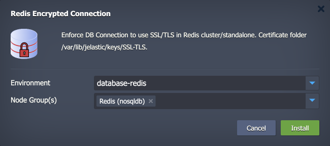
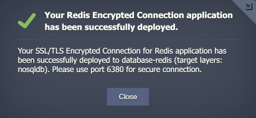
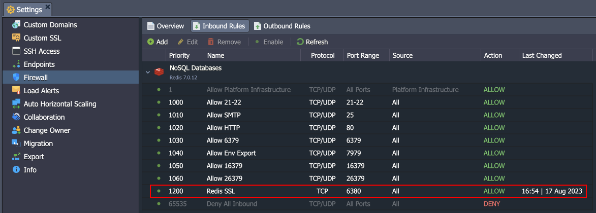
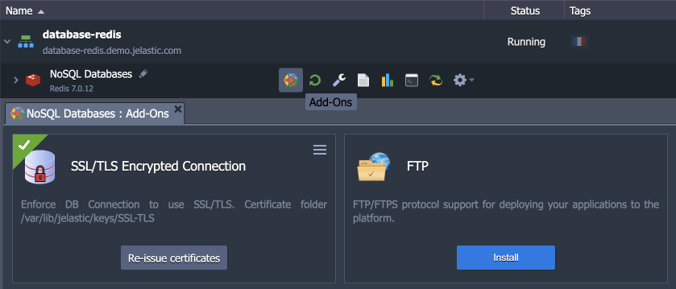
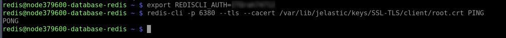
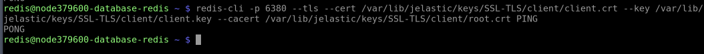

<p align="center">

</p>

# SSL/TLS Encrypted Connection for Redis

The add-on automates the SSL/TLS certificate generation and encryption configuration for both standalone and cluster Redis solutions on the Virtuozzo Application Platform. Get this standard security measure in just a minute, ensuring secure data exchange between server and client.


## Add-On Installation

The add-on can be installed on top of the **Redis** nodes only.

1\. Log into your Virtuozzo Application Platform and [import](https://www.virtuozzo.com/application-platform-docs/environment-import/) the add-on's manifest from this repository:

```
https://cdn.jsdelivr.net/gh/jelastic-jps/redis-ssl-addon@main/manifest.jps
```


Click **Import** to proceed.

2\. Within the opened installation window, select the target **Environment** and **Node Group(s)** where the add-on will be installed.



Click **Install** to continue.

3\. In a minute, your environment will be configured.



> **Note:** Port ***6380*** is used for secure connection by default and is automatically added to the [firewall rules](https://www.virtuozzo.com/application-platform-docs/custom-firewall/) during the add-on installation.
>
> 

You can find generated SSL certificates under the **/var/lib/jelastic/keys/SSL-TLS** folder.


## Add-On Configuration

After the installation, the add-on can be found under the **Add-Ons** tab for the appropriate layer.



Here you can click the **Re-issue certificates** button to generate SSL certificates for secure connection anew.

If no longer needed, remove the add-on from the layer by choosing the **Uninstall** option in the add-on menu in the top-right corner.


## Secure Connection to Redis

For secure connection (we’ll use the **[redis-cli](https://redis.io/docs/ui/cli/)** utility as an example), specify the command with the following options:

> **Tip:** You can store the database password in the dedicated *REDISCLI_AUTH* variable to avoid exposing it in the command line:
>
> ```export REDISCLI_AUTH={password}```

```
redis-cli -p 6380 --tls --cacert /var/lib/jelastic/keys/SSL-TLS/client/root.crt {command}
```



You can execute any preferred ***{command}*** or omit it to connect to the database in the interactive mode.

If the server requires authentication using a client-side certificate, you can specify a certificate and a corresponding private key using ***--cert*** and ***--key*** parameters.

```
redis-cli -p 6380 --tls --cert /var/lib/jelastic/keys/SSL-TLS/client/client.crt --key /var/lib/jelastic/keys/SSL-TLS/client/client.key --cacert /var/lib/jelastic/keys/SSL-TLS/client/root.crt {command}
```



For external connection, the client needs to upload the certificate files (*client.crt*, *client.key*, *root.crt*) to their computer/container/VM and use the `-h` option to specify a remote hostname or an IP address.